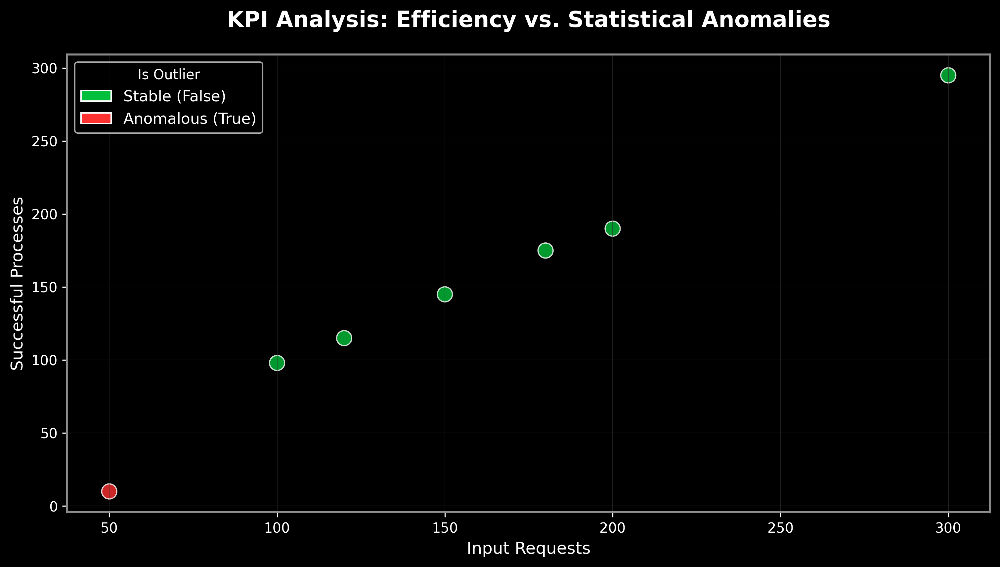

# KPIs Performance Optimization

### *Turning Noise into Insight*


---

## 🧠 Problem Statement

In a fast-paced call center environment, thousands of customer interactions happen daily — each one carrying signals of efficiency, frustration, and opportunity.

Yet, despite the abundance of data, decision-making often relies on intuition rather than evidence.

This project addresses a critical challenge:

> ❗ How can we transform raw operational data into actionable insights that improve customer satisfaction and agent performance?

---

## 🎯 Objectives

* 📉 Identify drivers of low customer satisfaction (CSAT)
* ⏱ Analyze factors affecting Average Handling Time (AHT)
* 🔁 Detect patterns behind repeat calls
* 👥 Segment agents based on performance
* 🤖 Build predictive models for customer satisfaction

---

## 📊 Project Overview

This project simulates a real-world call center dataset and applies data science techniques to uncover operational inefficiencies and optimization opportunities.

### 🔍 Key Focus Areas:

* Customer Satisfaction (CSAT)
* Call Duration & Hold Time
* First Call Resolution (FCR)
* Repeat Call Behavior
* Agent Performance Analysis

---

## 🧩 Dataset Structure

| Feature          | Description                              |
| ---------------- | ---------------------------------------- |
| `call_id`        | Unique call identifier                   |
| `agent_id`       | Agent responsible for the call           |
| `call_duration`  | Total call time (seconds)                |
| `hold_time`      | Time spent on hold                       |
| `csat_score`     | Customer rating (1–5)                    |
| `first_call_res` | Resolved on first call (1 = yes, 0 = no) |
| `repeat_call`    | Whether the customer called again        |
| `issue_type`     | Type of issue (Billing, Tech, General)   |
| `channel`        | Contact channel (Voice, Chat, Email)     |

---

## 🚀 Project Structure

```
📁 call-center-analytics/
│
├── 📄 README.md
├── 📂 data/
│   └── calls.csv
├── 📂 notebooks/
│   └── analysis.ipynb
├── 📂 src/
│   ├── preprocessing.py
│   ├── modeling.py
│   └── visualization.py
└── 📄 requirements.txt
```


# 📊 KPIs Performance Optimization & Risk Detection

[](#)
[](#)
[](#)

---

## 🌌 Context & Vision

Call centers and operational hubs are living systems where every interaction generates a data point. This project is designed to move beyond raw logs, creating a robust Python-based engine to sanitize data and extract actionable insights. 

**The goal:** Transform operational "noise" into a clear narrative of system health and risk mitigation.

---

## 🧠 Analysis & Methodology

To ensure the integrity of the results, the engine follows a structured data science pipeline:

* **Data Sanitization**: Handling missing values through median imputation and removing duplicates to prevent statistical bias.
* **Efficiency Modeling**: Calculating normalized "Efficiency Ratios" (Output/Input) to compare performance across varying volumes.
* **Anomaly Detection**: Utilizing Z-Score logic to identify performance outliers that deviate from the historical norm.

---

## 📈 Performance Visualization

Below is the automated output of our analysis. The visualization uses a **Dark Neon** theme for high contrast, specifically designed to highlight operational risks:

<p align="center">
  
</p>

### **Key Insights from the Chart**
* **Stable Path (Neon Green)**: Points following a linear trend indicate a healthy system where success scales with demand.
* **Statistical Outlier (Neon Red)**: The isolated red point identifies a critical failure—high volume but drastically low success rate—representing a systemic risk or technical bottleneck.

---

## 🛠️ Technical Stack

* **Engine**: Python 3.x
* **Data Processing**: `Pandas`, `NumPy`
* **Visualization**: `Seaborn`, `Matplotlib` (Custom Neon Dark Theme)
* **Logic**: Modular OOP (`PerformanceAnalyzer` class)

---

## 🚀 How to Run

1.  **Clone the repository**:
    ```bash
    git clone [https://github.com/thiagosilvaventura/KPIs-Performance-Optimization.git](https://github.com/thiagosilvaventura/KPIs-Performance-Optimization.git)
    ```
2.  **Install dependencies**:
    ```bash
    pip install -r requirements.txt
    ```
3.  **Generate the analysis**:
    ```bash
    python kpivisualization.py
    ```

---

<p align="center">
  Developed with focus on <b>Risk Management</b> and <b>Operational Excellence</b>.
</p>


